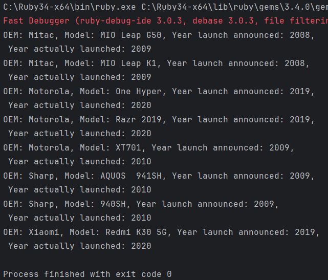
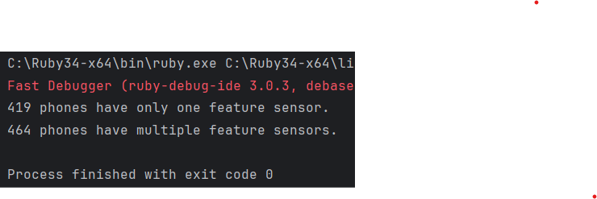
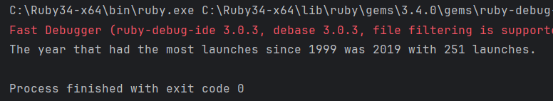

# Alternative Language Project: Ruby
For this project, I chose Ruby 3.4.4, which was the most recent version available 
to me when I began. Ruby 3.4.4 was released in May 2025, with the next version 
scheduled for release in July.

## Why Ruby?
Ruby is a flexible and powerful language with a relatively low barrier to entry. 
It also serves as a natural gateway to learning Ruby on Rails, a widely used web framework.

## Features of Ruby
#### Object-oriented programming 
Ruby is a fully object-oriented language—everything is treated as an object. 
This has benefits in terms of consistency and extensibility but can introduce quirks,
such as needing to explicitly convert objects to strings using .to_s when ingesting files.
#### File ingestion
Ruby provides familiar file handling through File.new and File.open, similar to other languages 
like Python and Java. However, Ruby’s built-in CSV library offers robust features tailored for 
working with .csv files.

The csv library allows csv files to be processed row by row using a simple
"CSV.foreach()" statement. It also comes with the row object that can easily
be turned into an array using "row.map{}".
#### Conditional statements
Ruby's if/elseif/else statements are similar to those in other languages
like Python or Java. What stands out to me is the "end" at the end of a
statement (as opposed to the same thing being accomplished by some set of
parentheses/brackets or whitespace).
#### Assignment statements
Ruby uses a simple equal operator ('=') as for assignment.
#### Loops
In addition to the usual while and for loops, Ruby supports an until loop, which 
functions similarly to a while loop but runs until a condition becomes true.
#### Subprograms (functions/methods)
In Ruby, functions or methods not associated with a class become methods of the
generic object "Object". The syntax used for any function or method is to begin with
"def" and end with "end".
#### Unit testing
Ruby includes the minitest framework for unit testing. A test class is created, 
typically instantiating the object(s) to be tested—in this case, an array of two Cell objects. 
Tests are defined as methods within the test class.

#### Exception handling
Exception handling in Ruby uses the rescue clause. Within rescue, you can optionally 
modify arguments and retry the operation using the retry keyword. The ensure clause 
ensures that a block of code is executed regardless of whether an exception occurs.

Ruby also supports throw and catch for flow control, similar to other languages.

## Libraries used
I needed to use the csv library to allow processing of the csv file in this project.
Ruby has support for regex built into the base language, so no library was needed.

Note: Although minitest was used for unit tests, it was not directly used in cell.rb.

## Results
#### What company (oem) has the highest average weight of the phone body?
HP had the highest average weight (453.6 grams).

Output:

#### Were there any phones that were announced in one year and released in another? What are they? Give me the oem and models.
Mitac: the MIO Leap G50 and MIO Leap K1 were announced in  2008, launched in 2009.

Motorola: the One Hyper and Razr 2019 were announced in 2019, launched in 2020; the XT701 was announced
in 2009, launched in 2010.

Sharp: the AQUOS 941SH and 940SH were announced in 2009, launched in 2010.

Xiaomi: the Redmi K30 5G was announced in 2019, launched in 2020.

Output:

#### How many phones have only one feature sensor?
419 phones only have one feature sensor.

Output:

#### What year had the most phones launched in any year later than 1999? 
2019 had the most launches since 1999, with 251 launches.

Output:

